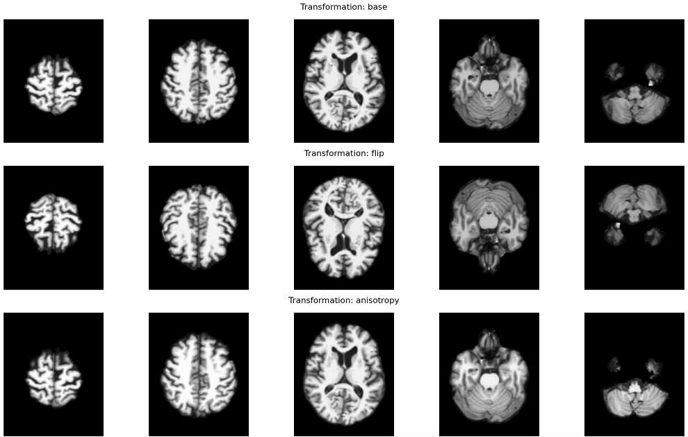

# Alzheimer's Disease Classification using SimCLR

This project implements a 3D Convolutional Neural Network (CNN) with SimCLR (Simple Framework for Contrastive Learning of Visual Representations) for Alzheimer's disease classification using MRI images. The model is designed to classify brain scans into three categories: Alzheimer's Disease (AD), Mild Cognitive Impairment (MCI), and Healthy Control (HC).

## Datasets
Here are the links:
- [Raw data](https://adni.loni.usc.edu/data-samples/adni-data/neuroimaging/mri/mri-image-data-sets/) 
  The ADNI 1 1.5T dataset was downloaded for this project.
- [Normalized data](https://storage.googleapis.com/colab-notebok-simclr/simclr/ADNI_Colab_uwdrive/)
  This folder contains 1,941 preprocessed MRI scans from the ADNI 1 dataset. Ten scans were discarded due to normalization failures. Each file represents a brain scan cropped from (256x256x256) to (173x199x215) to remove the black background, followed by normalization.


## Project Overview

The main components of this project include:

1. Data loading and preprocessing
2. SimCLR model implementation
3. Training with various data augmentation techniques
   
   This image shows different data augmentation techniques applied to brain MRI scans:
   - Base: Original unmodified images
   - Flip: Vertical flipping of the images
   - Anisotropy: Adjusting image resolution
     
   The full list of image augmentation methods includes:
   
   - Swap: Swapping certain parts of the image
   - Flip: Vertical flipping of the images
   - Anisotropy: Adjusting image resolution to simulate variations in scan quality
   - Swap: Swapping certain parts of the image to encourage learning of more general features
   - Elastic: Applying elastic deformations to simulate anatomical variability
   - Bias Field: Adding simulated intensity inhomogeneities to mimic MRI artifacts
   - Blur: Applying Gaussian blur to simulate motion or focus issues
   - Gamma: Adjusting image brightness and contrast
   - Spike: Adding spike noise to simulate scanner artifacts
   - Ghost: Simulating ghosting artifacts often seen in MRI
   - Noise: Adding random noise to the images
   - Motion: Simulating patient movement during scanning
   - Mixup: Blending two images together
   - CutMix: Replacing rectangular regions between images

These augmentation techniques help increase the diversity of the training data, potentially improving the model's ability to generalize to unseen data and handle various real-world imaging conditions.

5. Linear evaluation
6. Final model evaluation

## Prerequisites

For a list of required packages and versions, please see the [requirements.json](requirements.json) file.

To install the required packages, you can use the following command:

```bash
pip install -r <(python -c "import json; print('\n'.join([f'{p}' for p in json.load(open('requirements.json'))['packages']]))")
```
## Project Structure

- `data_loading_RS_oct.py`: Contains functions for data loading and preprocessing
- `model_RS_oct.py`: Defines the SimCLR3DCNN model architecture
- `training_RS_oct.py`: Implements the training loop, linear evaluation, and final evaluation
- `utils_RS_oct.py`: Utility functions for argument parsing, model saving/loading, and hardware info
- `main_RS_oct.py`: The main script that orchestrates the entire training process

## Usage

To run the training process:
python main_RS_oct.py --data_path /path/to/your/data.csv --save_dir /path/to/save/results

Additional arguments can be found in the `get_args()` function in `utils_RS_oct.py`.

## Features

- SimCLR training with various data augmentation techniques
- Ablation study to compare different augmentation methods
- Linear evaluation of the trained model
- Final evaluation with detailed metrics and confusion matrix
- TensorBoard integration for monitoring training progress
- Mixed precision training for improved performance

## Results

The script will output:

- Training and validation losses
- Best model checkpoints
- Linear evaluation accuracy
- Final evaluation report with precision, recall, F1-score, F3-score, and F5-score for each class
- Confusion matrix
- Training time reports

## Contributing

Feel free to fork this repository and submit pull requests. For major changes, please open an issue first to discuss what you would like to change.

## License

[MIT License](https://opensource.org/licenses/MIT)
